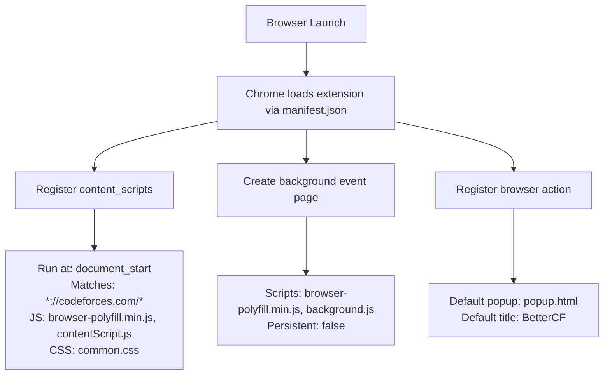
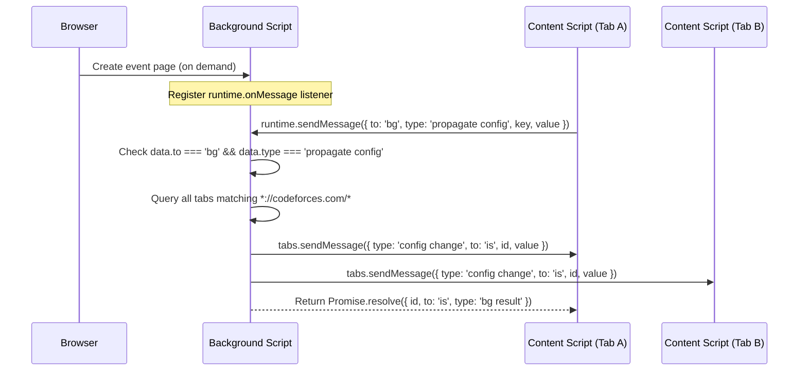
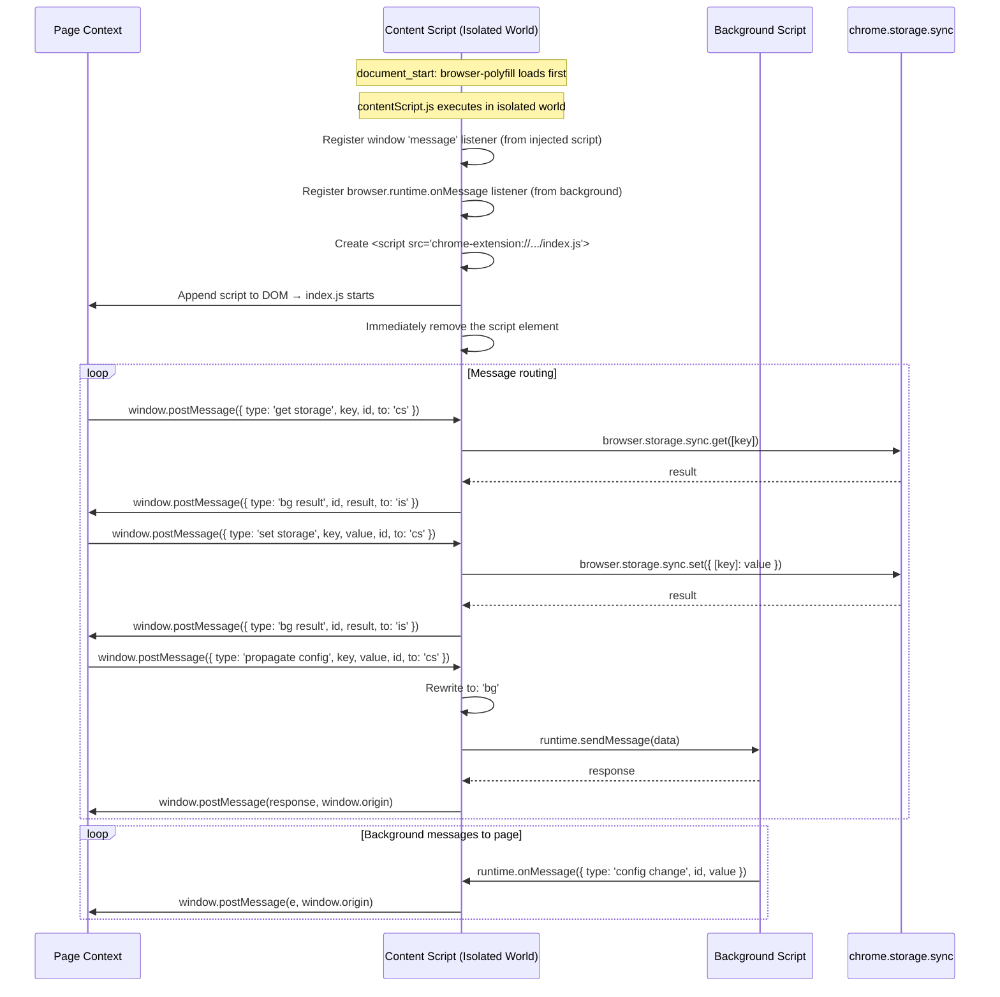
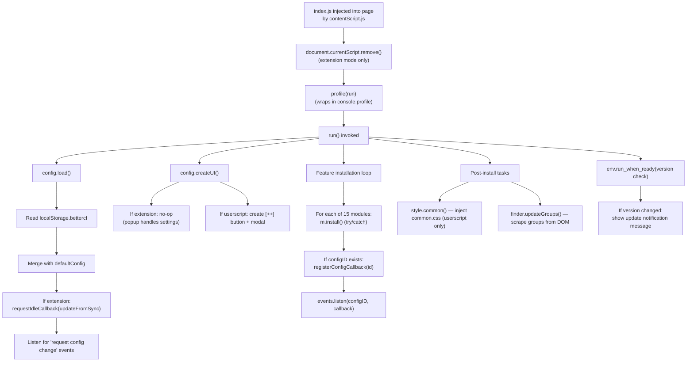
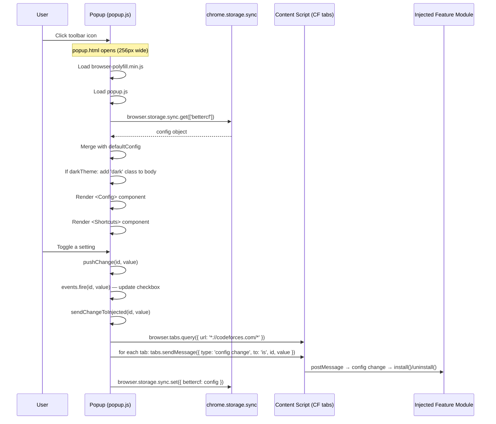

# Runtime Flow

## 1. How the Extension Starts from Browser Launch

The startup sequence differs between **extension mode** and **userscript mode**.

### Extension Mode



### Userscript Mode

```
Userscript Manager (Tampermonkey/Violentmonkey) loads script.user.js
  └─ Meta block (@match *://codeforces.com/*, @run-at document-start)
       ├─ Injects the entire bundled userscript as a single IIFE
       └─ All code runs inline in the page context (no separated content script / background)
```

---

## 2. Execution Flow — Background Script

### `background.js`



The background script is a **message relay only**. It has one responsibility: receive a 'propagate config' message and broadcast the config change to all open Codeforces tabs. It is a non-persistent event page (created on demand, destroyed when idle).

---

## 3. Execution Flow — Content Script

### `contentScript.js`



---

## 4. Execution Flow — Injected Script (`index.js`)

### Initialization Sequence



### Feature Installation Loop (detailed)

```javascript
// index.js modules array — executed in order
modules = [
    [style,              'style'],            // 1. Custom CSS injection
    [dark_theme,         'darkTheme'],        // 2. Dark mode class
    [show_tags,          'showTags'],         // 3. Show tags button
    [problemset,         'showTags'],         // 4. Problemset tags
    [search_button,      'searchBtn'],        // 5. Google It button
    [show_tutorial,      ''],                 // 6. Tutorial modal (always)
    [navbar,             ''],                 // 7. Dropdown navbar (always)
    [redirector,         ''],                 // 8. Link redirects (always)
    [update_standings,   'standingsItv'],     // 9. Auto-update standings
    [twin_standings,     'standingsTwin'],    // 10. Twin standings
    [verdict_test_number,'hideTestNumber'],   // 11. Hide test number
    [shortcuts,          ''],                 // 12. Keyboard shortcuts (always)
    [sidebar,            'sidebarBox'],       // 13. Sidebar action box
    [mashup,             ''],                 // 14. Mashup tools (always)
    [change_page_title,  ''],                // 15. Dynamic title (always)
]
```

For each module:
1. `m.install()` is called (wrapped in `tryCatch` for error isolation)
2. If a `configID` is provided, `registerConfigCallback(m, configID)` registers an event listener that calls `m.install()` or `m.uninstall()` when the config value changes

---

## 5. Execution Flow — Popup

### `popup.html` + `popup.js`



---

## 6. Runtime Execution Timeline

```
=== PAGE LOAD (User navigates to https://codeforces.com/...) ===

[0ms]         document_start
              ├─ Browser injects common.css (from manifest)
              ├─ Browser injects browser-polyfill.min.js
              └─ Browser injects contentScript.js
                   ├─ Registers window 'message' listener
                   ├─ Registers browser.runtime.onMessage listener
                   └─ Creates <script src="chrome-extension://.../index.js">
                   └─ Appends to DOM → index.js starts executing

[0-5ms]       index.js executes (page context)
              ├─ document.currentScript.remove() (extension only)
              ├─ profile(run)
              └─ run() invoked synchronously

[5-10ms]      run()
              ├─ config.load()
              │    ├─ Reads localStorage.bettercf (JSON.parse)
              │    ├─ Merges with defaultConfig
              │    ├─ If extension: requestIdleCallback(updateFromSync)
              │    └─ Listens for 'request config change'
              │
              ├─ config.createUI()
              │    └─ If userscript: creates [++] button and modal
              │
              ├─ modules.forEach(install):
              │    [style → dark_theme → show_tags → problemset →
              │     search_button → show_tutorial → navbar → redirector →
              │     update_standings → twin_standings → verdict_test_number →
              │     shortcuts → sidebar → mashup → change_page_title]
              │
              └─ Post-install:
                   ├─ style.common() → inject common.css (userscript)
                   └─ finder.updateGroups() → scrape groups (if on groups page)

[5-50ms]      Feature installs complete
              └─ Each config-gated module registers config callback

[50ms-2s]     DOMContentLoaded / document.readyState = 'complete'
              ├─ env.ready() callbacks fire
              │   (most features wrap install in env.ready, so actual DOM
              │    manipulation waits until DOM is ready)
              └─ env.run_when_ready(version check)
                   → Shows update notification if version changed

[2s+]         requestIdleCallback fires (extension mode)
              ├─ updateFromSync()
              │    ├─ MPH → Content Script → chrome.storage.sync.get('bettercf')
              │    ├─ Patches local config keys
              │    └─ Fires events for changed keys → triggers install/uninstall
              └─ show_tutorial's idle callback:
                   loadModal() → fetch tutorial, create modal (hidden)

=== ONGOING ===

[Every N seconds, if standingsItv > 0]
  └─ standings/update.js fires
       ├─ Fetches current standings URL
       ├─ Replaces #pageContent with fresh content
       ├─ Fires 'standings updated' event
       └─ Re-runs <script> tags

[User opens popup]
  └─ popup.html loads → popup.js reads sync storage → renders UI
  └─ Changes propagate to all CF tabs via sendChangeToInjected

[Config change from sync or other device]
  └─ updateFromSync() → patches config → fires events → features toggle
```
