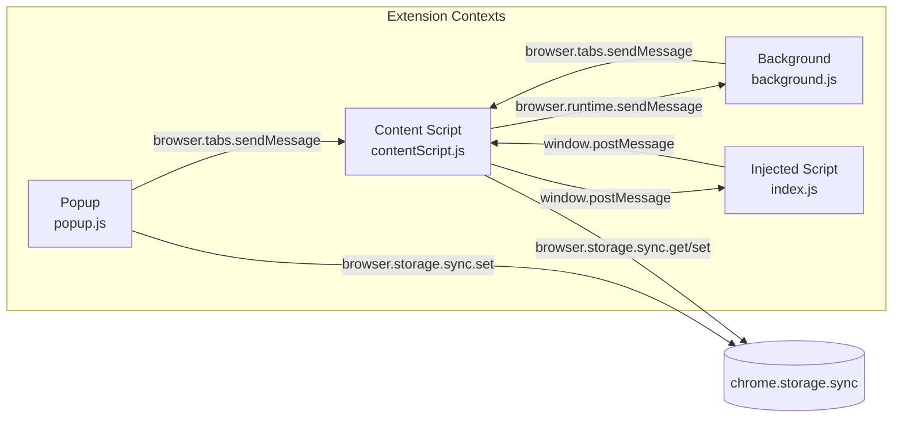
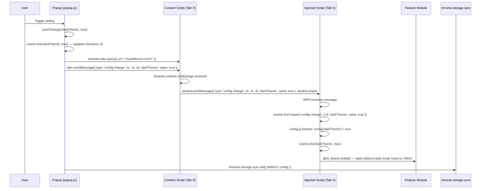
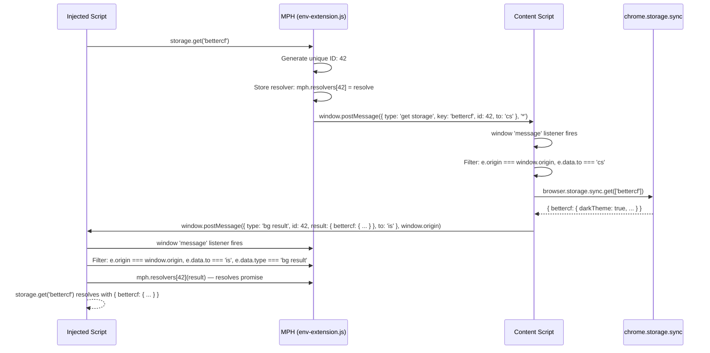
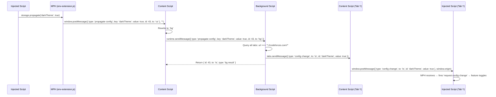

# Message Flow

## Overview

The extension uses a **three-layer message passing architecture** involving four execution contexts:

1. **Popup** → sends config changes to all Codeforces tabs via `browser.tabs.sendMessage`
2. **Background** → relays config propagation between contexts
3. **Content Script** → bridges the isolated world and the page context via `window.postMessage`
4. **Injected Script** → communicates with content script via MPH (Message-Passing Hell)



---

## Message Types

| Type | Direction | Payload | Purpose |
|------|-----------|---------|---------|
| `get storage` | IS → CS | `{ key }` | Read from `chrome.storage.sync` |
| `set storage` | IS → CS | `{ key, value }` | Write to `chrome.storage.sync` |
| `propagate config` | IS → CS → BG | `{ key, value }` | Broadcast config to all tabs |
| `config change` | POPUP → CS → IS | `{ id, value }` | Push config change from popup |
| `config change` | BG → CS → IS | `{ id, value }` | Push config change from background relay |
| `bg result` | CS → IS | `{ id, result }` | Response from storage/background operations |
| `error` | CS → IS | `{ id, error }` | Error response from storage/background |

---

## Message Flow: Popup Config Change

This is the most common message flow — a user changes a setting in the popup.



---

## Message Flow: Injected Script Storage Read



---

## Message Flow: Injected Script Config Propagation



---

## MPH (Message-Passing Hell) System

The MPH is a request-response system built on top of `window.postMessage`. Defined in `src/env/env-extension.js`.

### MPH Architecture

```
mph = {
    resolvers: {           // Map of pending request IDs to Promise resolvers
        42: resolveFn,     
        43: resolveFn      
    },
    genID: function(),     // Auto-incrementing ID generator
    initialized: false,    // Guard for init() idempotency
    send: function(),      // Send a message and return Promise
    init: function()       // Register the window message listener
}
```

### Send Flow

1. `mph.send(message)` is called
2. Generates a new unique ID via `genID`
3. Stores `message.id = id` and sets `message.to = 'cs'`
4. Stores `this.resolvers[id] = resolve` (Promise resolver)
5. Calls `window.postMessage(message, '*')`
6. Starts a 20-second timeout (rejects if no response)
7. Returns a Promise

### Receive Flow

1. `window.addEventListener('message', ...)` fires
2. Filters: `e.origin === window.origin && e.data.to === 'is'`
3. Checks `e.data.type`:
   - `'bg result'`: Resolves the stored resolver with `e.data.result`, deletes from `resolvers` map
   - `'config change'`: Fires `events.fire('request config change', { id, value })`

### Security Note

The MPH uses `window.postMessage(message, '*')` with a wildcard target origin. This is noted as a security consideration — the `origin` check happens on the receiving end (`e.origin === window.origin`), but the `*` target allows any window to receive the message.
