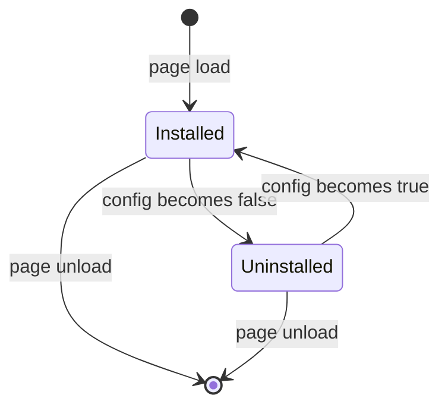
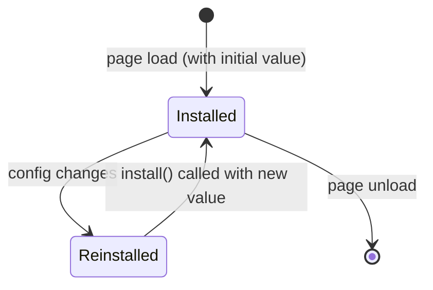
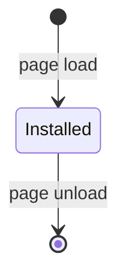

# Feature Registry

## Feature Table

| # | Feature | File | Config Key | Type | Dependencies | UI Elements | Events Used |
|---|---------|------|-----------|------|-------------|-------------|-------------|
| 1 | Custom Style | `ext/style.js` | `style` | boolean toggle | dom, config | `<style class="bettercf-style">` | `'style'` |
| 2 | Dark Theme | `ext/dark_theme.js` | `darkTheme` | boolean toggle | config | `<html class="bettercf-dark-mode">` | `'darkTheme'` |
| 3 | Show Tags | `ext/show_tags.js` | `showTags` | boolean toggle | dom, config, env | `<button class="showTagsBtn">Show` | `'showTags'` |
| 4 | Problemset Tags | `ext/problemset.js` | `showTags` | boolean toggle | dom, config, env | (hides existing DOM) | `'showTags'` |
| 5 | Google It | `ext/search_button.js` | `searchBtn` | boolean toggle | dom, env | `<a class="searchBtn">Google It` | `'searchBtn'` |
| 6 | Tutorial | `ext/show_tutorial.js` | (always) | — | dom, env, once, config, events | Modal `<div class="bettercf-tutorial">`, `<a>Tutorial` | `'tutorialSpoilers'` |
| 7 | Navbar | `ext/navbar.js` | (always) | — | dom, env | `<nav class="bettercf-navbar">` with dropdowns | none |
| 8 | Redirector | `ext/redirector.js` | (always) | — | dom, config, env | "Start virtual contest" sidebar box | none |
| 9 | Auto-Update Standings | `ext/standings/update.js` | `standingsItv` | number | dom, env, config, events, common | (replaces pageContent) | `'standingsItv'` |
| 10 | Twin Standings | `ext/standings/twin.js` | `standingsTwin` | boolean toggle | dom, env, config, events, common, once | `<div id="bettercf-twin-standings">` | `'standingsTwin'` |
| 11 | Hide Test Number | `ext/verdict_test_number.js` | `hideTestNumber` | boolean toggle | dom, config, safe, env | `<html class="verdict-hide-number">` | `'hideTestNumber'` |
| 12 | Shortcuts | `ext/shortcuts.js` | (always) | — | dom, finder, config, events, formatShortcut | (keyboard only) | `'shortcuts'` |
| 13 | Sidebar Box | `ext/sidebar.js` | `sidebarBox` | boolean toggle | dom, config, env, flatten, pipe, forEach | Moved links in sidebar table | `'sidebarBox'` |
| 14 | Finder | `ext/finder.js` | (always) | — | dom, config, safe, pipe, map, once, flatten, util, env | Modal with `.finder-input` + `.finder-results` | none |
| 15 | Mashup | `ext/mashup.js` | (always) | — | dom, config, env | "Add all" button, "Toggle tag spoilers" button | `'mashupSpoilers'` |
| 16 | Change Page Title | `ext/change_page_title.js` | (always) | — | env, dom | (changes document.title) | none |

---

## Feature Lifecycle

### Config-Gated Features (booleans)



### Config-Gated Features (non-booleans, e.g., number)



### Always-Installed Features



---

## Install/Uninstall Behavior

| Feature | install() | uninstall() |
|---------|-----------|-------------|
| **style** | If config.get('style'): inject custom.css `<style>` element | Remove the injected `<style>` element |
| **dark_theme** | If config.get('darkTheme'): add `bettercf-dark-mode` class to `<html>` | Remove `bettercf-dark-mode` class |
| **show_tags** | If tags exist and no AC: hide tag container, create "Show" button | Remove button, restore tag visibility |
| **problemset** | If showTags enabled and on problemset: hide tags on unsolved rows | Show all tags (set display to block) |
| **search_button** | If on gym/group problem: create Google search link in menu | Remove search button element |
| **show_tutorial** | Add "Tutorial" button to second-level menu, preload content | N/A (no config callback) |
| **navbar** | Build dropdown navbar from existing nav items, replace old nav, change logo | N/A |
| **redirector** | Rewrite group links, standings links, add virtual contest button | N/A |
| **update_standings** | If interval > 0 and on standings page: start `setInterval` update | `clearInterval` |
| **twin_standings** | If enabled and on contest standings: verify twin via API, fetch and append twin content | Remove `#bettercf-twin-standings` container |
| **verdict_test_number** | If enabled: proxy `Codeforces.showMessage`, subscribe to `submissionsEventCatcher`, add CSS class | Remove CSS class (proxy and subscription remain until page reload) |
| **shortcuts** | Bind `keydown` listener on document, convert config shortcuts to function map | N/A |
| **sidebar** | Move second-level menu links and sidebar forms into sidebar box | Show "please refresh" message (cannot undo DOM moves) |
| **finder** | Create finder modal (lazy via once()), bind search/navigation events | N/A |
| **mashup** | Add "Add all" button and tag spoilers toggle to mashup form | N/A |
| **change_page_title** | Set `document.title` to problem title | N/A |

---

## Feature Loading Order

The `modules` array in `index.js` defines the exact load order:

```
 1. style          (CSS injection — must be first for visual consistency)
 2. dark_theme     (dark mode — must apply before other UI elements)
 3. show_tags      (problem tags toggle)
 4. problemset     (problemset tags hiding)
 5. search_button  ("Google It" button)
 6. show_tutorial  (tutorial modal button)
 7. navbar         (custom navigation bar — replaces old nav)
 8. redirector     (link rewriting — runs on existing DOM)
 9. update_standings (auto-refresh timer — needs to be after DOM ready)
10. twin_standings (twin standings — may depend on page structure)
11. verdict_test_number (hide test number — patches globals)
12. shortcuts      (keyboard bindings — runs after all UI is in place)
13. sidebar        (sidebar action box — moves menu elements)
14. mashup         (mashup tools — only activates on mashup pages)
15. change_page_title (set document title — last, non-critical)
```

Post-install tasks:
1. `style.common()` — inject common.css (userscript only)
2. `finder.updateGroups()` — scrape user groups from DOM (if on groups page)

Post-DOM-ready:
1. Version check — shows update notification if version changed

---

## Config Keys Reference

| Config Key | Type | Default | Description |
|-----------|------|---------|-------------|
| `showTags` | boolean | `true` | Show tags toggle button on problem pages |
| `style` | boolean | `true` | Apply custom Codeforces CSS |
| `darkTheme` | boolean | `false` | Dark mode |
| `standingsItv` | number | `0` | Standings auto-update interval (seconds, 0 = disabled) |
| `standingsTwin` | boolean | `false` | Show div1 + div2 standings on same page |
| `defStandings` | string | `"common"` | Default standings view: `"Common"` or `"Friends"` |
| `hideTestNumber` | boolean | `false` | Hide "on test X" in verdicts |
| `sidebarBox` | boolean | `true` | Enable sidebar action box |
| `tutorialSpoilers` | boolean | `false` | Enable tutorial spoilers by default |
| `mashupSpoilers` | boolean | `false` | Enable mashup tag spoilers |
| `shortcuts` | object | (see below) | Keyboard shortcut bindings |
| `version` | string | (from package.json) | Last known version (update notification) |

### Default Shortcuts

| Shortcut ID | Default Binding | Action |
|-------------|----------------|--------|
| `darkTheme` | `Ctrl+I` | Toggle dark mode |
| `finder` | `Ctrl+Space` | Open Finder |
| `submit` | `Ctrl+S` | Open file picker to submit |
| `scrollToContent` | `Ctrl+Alt+C` | Scroll to page content |
| `hideTestNumber` | `Ctrl+Shift+H` | Toggle "on test X" hiding |
