# Module Dependency

## Complete Dependency Graph

```mermaid
flowchart TB
    subgraph Entry Points
        INDEX[index.js]
        CONTENT[contentScript.js]
        BG[background.js]
        POPUP[popup.js]
    end
    
    subgraph Environment
        ENV[env/env.js]
        CONFIG[env/config.js]
        CONFIG_UI[env/config_ui.js]
        ENV_SHARED[env/env-shared.js]
        ENV_EXT[env/env-extension.js]
        ENV_US[env/env-userscript.js]
    end
    
    subgraph Helpers
        DOM[helpers/dom.js]
        EVENTS[helpers/events.js]
        FUNC[helpers/Functional.js]
        UTIL[helpers/util.js]
    end
    
    subgraph Features
        STYLE[ext/style.js]
        DARK[ext/dark_theme.js]
        TAGS[ext/show_tags.js]
        PSET[ext/problemset.js]
        SEARCH[ext/search_button.js]
        TUTORIAL[ext/show_tutorial.js]
        NAVBAR[ext/navbar.js]
        REDIR[ext/redirector.js]
        VERDICT[ext/verdict_test_number.js]
        SHORTCUTS[ext/shortcuts.js]
        SIDEBAR[ext/sidebar.js]
        FINDER[ext/finder.js]
        MASHUP[ext/mashup.js]
        TITLE[ext/change_page_title.js]
    end
    
    subgraph Standings
        STAND_COMMON[ext/standings/common.js]
        STAND_UPDATE[ext/standings/update.js]
        STAND_TWIN[ext/standings/twin.js]
    end

    %% Entry point dependencies
    INDEX --> STYLE & DARK & TAGS & PSET & SEARCH & TUTORIAL & NAVBAR & REDIR
    INDEX --> STAND_UPDATE & STAND_TWIN & VERDICT & SHORTCUTS & SIDEBAR
    INDEX --> FINDER & MASHUP & TITLE
    INDEX --> ENV & CONFIG & EVENTS
    INDEX --> FUNC
    
    POPUP --> DOM & EVENTS & CONFIG_UI
    POPUP -.-> CONFIG
    
    %% Feature → helper dependencies
    STYLE --> DOM & CONFIG
    DARK --> CONFIG
    TAGS --> DOM & CONFIG & ENV
    PSET --> DOM & CONFIG & ENV
    SEARCH --> DOM & ENV
    TUTORIAL --> DOM & ENV & FUNC & CONFIG & EVENTS
    NAVBAR --> DOM & ENV
    REDIR --> DOM & CONFIG & ENV
    VERDICT --> DOM & CONFIG & FUNC & ENV
    SHORTCUTS --> DOM & CONFIG & EVENTS & FUNC
    SHORTCUTS --> FINDER
    SIDEBAR --> DOM & CONFIG & ENV & FUNC
    FINDER --> DOM & CONFIG & FUNC & ENV
    FINDER --> UTIL
    MASHUP --> DOM & CONFIG & ENV
    TITLE --> ENV & DOM
    
    %% Standings dependencies
    STAND_UPDATE --> DOM & ENV & CONFIG & EVENTS
    STAND_UPDATE --> STAND_COMMON
    STAND_TWIN --> DOM & ENV & CONFIG & EVENTS & FUNC
    STAND_TWIN --> STAND_COMMON
    STAND_COMMON --> DOM
    
    %% Environment dependencies
    ENV --> ENV_SHARED & ENV_EXT & ENV_US
    ENV_SHARED --> DOM & FUNC
    ENV_EXT --> FUNC & EVENTS
    ENV_US --> FUNC
    
    %% Config dependencies
    CONFIG --> DOM & FUNC & EVENTS & ENV
    CONFIG --> CONFIG_UI
    CONFIG_UI --> DOM & FUNC
    
    UTIL --> ENV
    
    %% Content/background have no internal imports
    CONTENT -.->|uses browser global| BROWSER(browser API)
    BG -.->|uses browser global| BROWSER
```

---

## Dependency Summary Table

### Module: Internal Dependencies

| Module | Internal Dependencies | External Dependencies |
|--------|----------------------|----------------------|
| `helpers/dom.js` | None | None |
| `helpers/events.js` | None | None |
| `helpers/Functional.js` | None | None |
| `helpers/util.js` | `env/env.js` | None |
| `env/env-shared.js` | `helpers/dom.js`, `helpers/Functional.js` | None |
| `env/env-extension.js` | `helpers/Functional.js`, `helpers/events.js` | None |
| `env/env-userscript.js` | `helpers/Functional.js` | None |
| `env/env.js` | `env/env-shared.js`, `env/env-extension.js`, `env/env-userscript.js` | None |
| `env/config.js` | `helpers/dom.js`, `helpers/Functional.js`, `helpers/events.js`, `env/env.js`, `env/config_ui.js` | None |
| `env/config_ui.js` | `helpers/dom.js`, `helpers/Functional.js` | None |

### Module: Feature Dependencies

| Feature | Internal Dependencies | External / Page Globals |
|---------|----------------------|------------------------|
| `ext/style.js` | `helpers/dom.js`, `env/config.js` | CSS files (common.css, custom.css) |
| `ext/dark_theme.js` | `env/config.js` | None |
| `ext/show_tags.js` | `helpers/dom.js`, `env/config.js`, `env/env.js` | None |
| `ext/problemset.js` | `helpers/dom.js`, `env/config.js`, `env/env.js` | None |
| `ext/search_button.js` | `helpers/dom.js`, `env/env.js` | None |
| `ext/show_tutorial.js` | `helpers/dom.js`, `env/env.js`, `helpers/Functional.js`, `env/config.js`, `helpers/events.js` | `MathJax` (page global) |
| `ext/navbar.js` | `helpers/dom.js`, `env/env.js` | None |
| `ext/redirector.js` | `helpers/dom.js`, `env/config.js`, `env/env.js` | None |
| `ext/verdict_test_number.js` | `helpers/dom.js`, `env/config.js`, `helpers/Functional.js`, `env/env.js` | `Codeforces.showMessage`, `submissionsEventCatcher` |
| `ext/shortcuts.js` | `helpers/dom.js`, `ext/finder.js`, `env/config.js`, `helpers/events.js`, `helpers/Functional.js` | None |
| `ext/sidebar.js` | `helpers/dom.js`, `env/config.js`, `env/env.js`, `helpers/Functional.js` | None |
| `ext/finder.js` | `helpers/dom.js`, `env/config.js`, `helpers/Functional.js`, `helpers/util.js`, `env/env.js` | None |
| `ext/mashup.js` | `helpers/dom.js`, `env/config.js`, `env/env.js` | None |
| `ext/change_page_title.js` | `env/env.js`, `helpers/dom.js` | None |
| `ext/standings/common.js` | `helpers/dom.js` | None |
| `ext/standings/update.js` | `helpers/dom.js`, `env/env.js`, `env/config.js`, `helpers/events.js`, `ext/standings/common.js` | None |
| `ext/standings/twin.js` | `helpers/dom.js`, `env/env.js`, `env/config.js`, `helpers/events.js`, `ext/standings/common.js`, `helpers/Functional.js` | Codeforces API |

### Module: Entry Points

| Entry Point | Dependencies | Purpose |
|-------------|-------------|---------|
| `index.js` | All 15 ext/* modules, env, config, events, Functional | Orchestrator — installs all features |
| `contentScript.js` | None (uses `browser` global) | Message bridge in isolated world |
| `background.js` | None (uses `browser` global) | Config relay event page |
| `popup.js` | dom, events, config_ui, config (defaultConfig only) | Popup settings UI |

---

## Import/Export Reference

### Key: What Each File Exports

| File | Export Style | Exported Identifiers |
|------|-------------|---------------------|
| `helpers/dom.js` | default | `{ $, $$, on, element, fragment, isEditable }` |
| `helpers/events.js` | named | `listen(event, callback)`, `fire(event, data)` |
| `helpers/Functional.js` | named | `curry`, `tryCatch`, `safe`, `pipe`, `map`, `forEach`, `zipBy2`, `flatten`, `once`, `pluck`, `capitalize`, `nop`, `formatShortcut`, `debounce`, `time`, `profile` |
| `helpers/util.js` | named | `toggleCoachMode()` |
| `env/env.js` | default | merged env object |
| `env/env-shared.js` | named | `version`, `ready()`, `run_when_ready()`, `userHandle()` |
| `env/env-extension.js` | named | `global`, `storage` |
| `env/env-userscript.js` | named | `global`, `storage` |
| `env/config.js` | named | `save()`, `commit()`, `get()`, `set()`, `toggle()`, `defaultConfig`, `load()`, `createUI`, `closeUI()` |
| `env/config_ui.js` | named | `prop()`, `configProps`, `scProp()`, `shortcutProps`, `Config`, `Shortcuts` |

### Feature Module Export Pattern

Every feature in `ext/` exports:
- `install` — required, typically wrapped in `env.ready(fn)`
- `uninstall` — optional, used for config-gated features

Some modules export additional functions:
- `ext/style.js`: `custom()`, `common()`
- `ext/finder.js`: `create`, `open`, `close`, `updateGroups`
- `ext/verdict_test_number.js`: `init()`
- `ext/standings/twin.js`: `update`
- `ext/standings/common.js`: `runScripts()`, `getStandingsPageContent()`

---

## Circular Dependency Notes

The `formatShortcut` function is in `helpers/Functional.js` rather than `ext/shortcuts.js` specifically to avoid a circular dependency. The comment in the source file reads:

> _"It's in Functional.js because putting it in shortcuts.js created a circular dependency, and I don't like warnings in my builds"_

The circular dependency would have been: `shortcuts.js → finder.js → config.js → config_ui.js → shortcuts.js`.

No other circular dependencies exist in the codebase.
