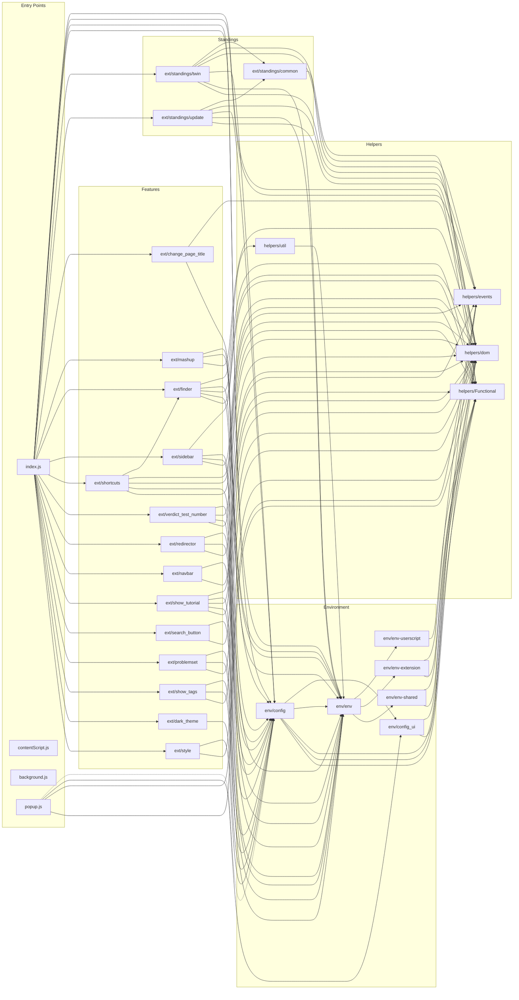
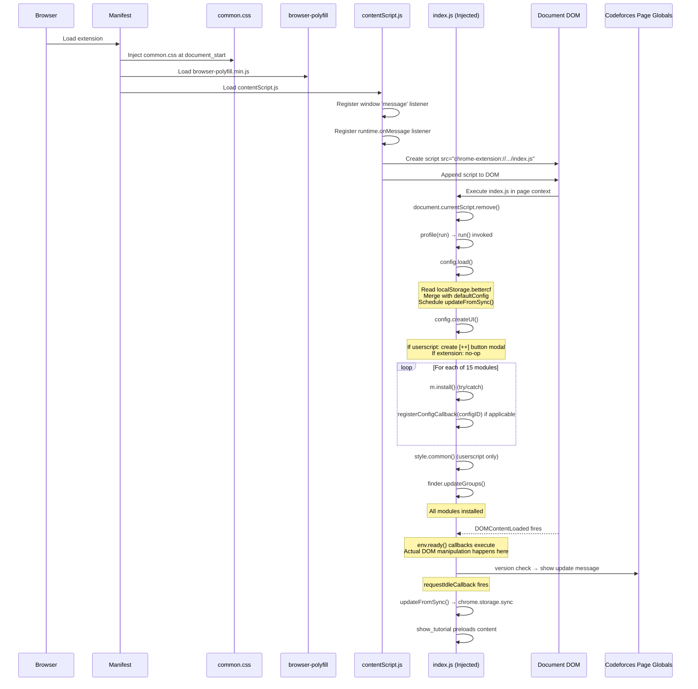
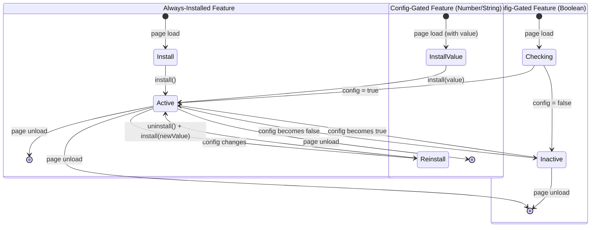
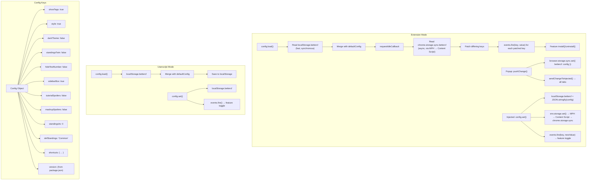

# Architecture Diagrams

## 1. System Architecture — Layer Diagram

```mermaid
flowchart TB
    subgraph "Browser Extension (Manifest V2)"
        POPUP["Popup (popup.html/popup.js)
                Settings UI
                Reads/writes chrome.storage.sync
                Sends config changes to all CF tabs"]
        
        subgraph "Background (Event Page)"
            BG["background.js
                 Config propagation relay
                 Receives 'propagate config'
                 Broadcasts to all Codeforces tabs"]
        end
        
        subgraph "Content Script (Isolated World)"
            CS["contentScript.js
                 Message bridge
                 Routes window.postMessage ↔ extension APIs
                 Injects index.js into page context"]
        end
        
        subgraph "Injected Script (Page Context)"
            INDEX["index.js — Orchestrator
                   Config management (localStorage + sync)
                   Feature module installation (15 features)
                   Custom event bus (helpers/events)
                   Custom JSX DOM creation (helpers/dom)"]
                   
            subgraph "Feature Modules"
                STYLE["ext/style.js"]
                DARK["ext/dark_theme.js"]
                TAGS["ext/show_tags.js"]
                PSET["ext/problemset.js"]
                SEARCH["ext/search_button.js"]
                TUTORIAL["ext/show_tutorial.js"]
                NAVBAR["ext/navbar.js"]
                REDIR["ext/redirector.js"]
                STAND["ext/standings/*.js"]
                VERDICT["ext/verdict_test_number.js"]
                SHORTCUT["ext/shortcuts.js"]
                SIDEBAR["ext/sidebar.js"]
                FINDER["ext/finder.js"]
                MASHUP["ext/mashup.js"]
                TITLE["ext/change_page_title.js"]
            end
            
            subgraph "Environment"
                ENV["env/env.js"]
                CONFIG["env/config.js"]
                CONFIG_UI["env/config_ui.js"]
            end
            
            subgraph "Utilities"
                DOM["helpers/dom.js
                     Custom JSX pragma"]
                EVENTS["helpers/events.js
                        Event bus"]
                FUNC["helpers/Functional.js
                      FP utilities"]
                UTIL["helpers/util.js"]
            end
        end
    end
    
    subgraph "Storage"
        LS["localStorage
            bettercf config (primary)
            finderPriority
            userGroups"]
        SS["chrome.storage.sync
            bettercf config (cross-device)"]
    end
    
    subgraph "Codeforces Page"
        CF["Codeforces globals
            Codeforces.*
            MathJax
            submissionsEventCatcher"]
    end
    
    POPUP -->|"browser.tabs.sendMessage"| CS
    POPUP -->|"browser.storage.sync.set"| SS
    CS -->|"browser.runtime.sendMessage"| BG
    BG -->|"browser.tabs.sendMessage"| CS
    CS -->|"window.postMessage"| INDEX
    INDEX -->|"window.postMessage"| CS
    CS -->|"browser.storage.sync.get/set"| SS
    INDEX -->|"localStorage"| LS
    INDEX --> CF
    
    ENV --> EVENTS & DOM & FUNC
    CONFIG --> ENV & CONFIG_UI & EVENTS & DOM & FUNC
    INDEX -.-> ENV & CONFIG & EVENTS & FUNC & DOM
    INDEX --> STYLE & DARK & TAGS & PSET & SEARCH & TUTORIAL
    INDEX --> NAVBAR & REDIR & STAND & VERDICT & SHORTCUT
    INDEX --> SIDEBAR & FINDER & MASHUP & TITLE
```

---

## 2. Module Dependency Diagram

---

## 3. Startup Sequence — Timeline

---

## 4. Message Flow — Complete Diagram

```mermaid
flowchart TB
    subgraph "Message Channels"
        IPC1["browser.tabs.sendMessage"]
        IPC2["browser.runtime.sendMessage"]
        IPC3["window.postMessage"]
        IPC4["browser.storage.sync"]
    end
    
    subgraph "Popup Config Change"
        POPUP["Popup toggles setting"]
        POPUP -->|"browser.tabs.query +<br/>tabs.sendMessage"| CS_TAB["Content Script (Tab)"]
        CS_TAB -->|"window.postMessage"| IS_TAB["Injected Script"]
        IS_TAB -->|"events.fire('request config change')"| CONFIG_MGR["config.js"]
        CONFIG_MGR -->|"events.fire(configKey)"| FEATURE["Feature module<br/>install()/uninstall()"]
        POPUP -->|"browser.storage.sync.set"| STORAGE["chrome.storage.sync"]
    end
    
    subgraph "Storage Read from Injected"
        IS_READ["Injected: storage.get()"]
        IS_READ -->|"postMessage { type:'get storage' }"| CS_STOR["Content Script"]
        CS_STOR -->|"browser.storage.sync.get()"| STORAGE2["chrome.storage.sync"]
        STORAGE2 -->|"result"| CS_STOR
        CS_STOR -->|"postMessage { type:'bg result' }"| IS_READ
    end
    
    subgraph "Config Propagation"
        IS_PROP["Injected: storage.propagate()"]
        IS_PROP -->|"postMessage { type:'propagate config' }"| CS_PROP["Content Script"]
        CS_PROP -->|"runtime.sendMessage { to:'bg' }"| BG["Background Script"]
        BG -->|"Query tabs: codeforces.com/*"| BG
        BG -->|"tabs.sendMessage to each tab"| CS_OTHER["Content Script (other tabs)"]
        CS_OTHER -->|"postMessage { type:'config change' }"| IS_OTHER["Injected (other tabs)"]
        IS_OTHER -->|"feature toggles"| FEATURES_OTHER["Feature modules"]
    end
    
    subgraph "Background to all tabs"
        BG2["Background receives message"]
        BG2 -->|"Broadcast to all CF tabs"| CS_ALL["All Content Scripts"]
        CS_ALL -->|"Forward to page context"| IS_ALL["All Injected Scripts"]
    end
```

---

## 5. Feature Lifecycle — State Machine

---

## 6. Configuration Storage Architecture

---

## 7. Features by Page Type

```mermaid
flowchart TB
    subgraph "Codeforces Pages"
        ANY["ANY Page<br/>(codeforces.com/*)"]
        PROBLEM["Problem Page<br/>/problem/, /contest/*/problem/*"]
        PROBLEMSET["Problemset Page<br/>/problemset"]
        GYM["Gym/Group Page<br/>/gym/*, /group/*"]
        STANDINGS["Standings Page<br/>/standings"]
        MASHUP["Mashup Page<br/>/mashups"]
        CONTEST["Contest Page<br/>/contest/*"]
    end
    
    subgraph "Features by Page"
        ANY --> |"Always"| DARK["Dark Theme"]
        ANY --> |"Always"| NAV["Custom Navbar"]
        ANY --> |"Always"| REDIR["Link Redirects"]
        ANY --> |"Always"| SHORTCUTS["Keyboard Shortcuts"]
        ANY --> |"Always"| FINDER["Finder (Ctrl+Space)"]
        ANY --> |"Always"| STYLE["Custom CSS"]
        ANY --> |"Always"| SIDEBAR["Sidebar Box"]
        ANY --> |"Toggle"| VERDICT["Hide Test Number"]
        
        PROBLEM --> |"Always"| TITLE["Change Page Title"]
        PROBLEM --> |"Toggle"| SHOW_TAGS["Show Tags Button"]
        PROBLEM --> |"Always"| TUTORIAL["Tutorial Button"]
        
        PROBLEMSET --> |"Toggle"| PSET_TAGS["Hide Tags (unsolved)"]
        
        GYM --> |"Toggle"| SEARCH_IT["Google It Button"]
        GYM --> |"Always"| VIRTUAL["Start Virtual Button"]
        
        STANDINGS --> |"Interval"| UPDATE["Auto-Update Standings"]
        STANDINGS --> |"Toggle"| TWIN["Twin Standings"]
        
        MASHUP --> |"Always"| MASHUP_FEATURES["Add All Button<br/>Tag Spoilers"]
        
        CONTEST --> |"Always"| CONTEST_STANDINGS["Standings Links"]
    end
```

